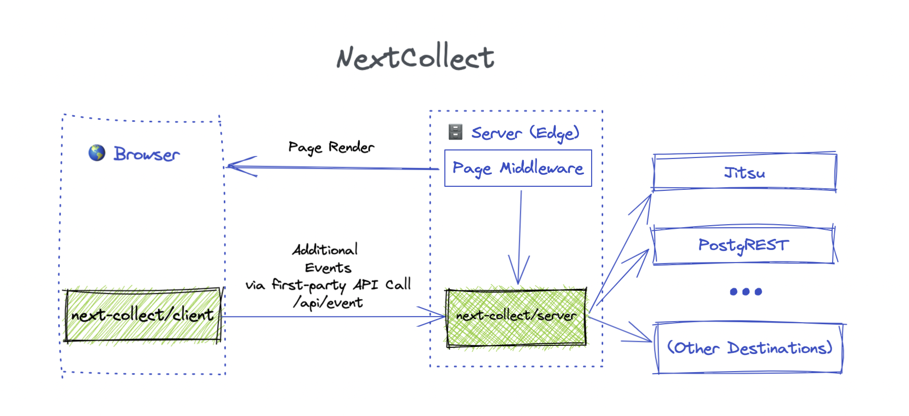

> **Warning**
> This version (`0.1.*` / `next_middleware_legacy` branch) is compatible with Next.JS `12.1.*` only. Since Next.JS `12.2.*`, the
> middleware [API has changed](https://nextjs.org/docs/messages/middleware-upgrade-guide), so
> you'll need to use next collect `0.2.1` or higher.





# Overview

NextCollect.js is a framework for server-side user event collection for Next.Js. It is designed from the ground up to work in Serverless environment.

NextCollect is destination agnostic. It could send data to multiple destinations at once. So far we support Jitsu, Segment and PostgREST (compatible
with [Supabase](https://supabase.com/docs/guides/api#rest-api-2))

## Server-Side vs Client-Side event collection

**Client-Side** user tracking means that once user loads the page (or makes another action), piece of JavaScript code sends the data to collector server. This is how most of the analytics trackers
works: GoogleAnalytics, Segment, Amplitude, etc.
**Server-Side** tracking happens when server (backend) renders the page or answers API call. No JavaScript code is touched.

### Why go Server-Side

* **Reliability**. 100% events will be recorded. Unlike client-side trackers, server side trackers are insusceptible to AdBlockers
  and [Safari's Tracking Prevention](https://webkit.org/blog/7675/intelligent-tracking-prevention/).
* **Better user identification**. Server-side cookies are more reliable, especially when cookies are set under the same domain name as the main app
* **Better user experience**. Less javascript request means faster website
* **No middleman**. It's possible to distribute data to end destinations directly, bypassing Segment and other similar probles

## Best of the both worlds

`nextjs-collect` allows collect data client-side collection too. It exposes a first-parti api route `/api/event-sink`, so the events can be from client-side code. A good example of such event is a
user actions which do not call any server API, such button click on a button.

The data will be sent to `/api/collect`, and sensitive params such userId, ip address and so on will be resolved server-side. Since the api call is first-party (goes to the same host), it won't be
blocked by AdBlockers or tracking prevention.

See a full instruction on how to use client-side tracking below

## Getting Started

`npm install --save next-collect`. Make sure that Next.Js >= 12.0

## Usage

Create `page/_middleware.[js|ts]` file within you Next App:

```typescript
import {collectEvents} from 'next-collect/server'

export default collectEvents({destination: ["jitsu", "segment"]});
```

or wrap an existing middleware:

```typescript
import {collectEvents} from 'next-collect/server'

const middleware = (req, res) => {
}

export default collectEvents({
    middleware: middleware,
    destinations: ["jitsu", "segment"]
});
```

## Destinations

NextCollect is destination agnostic. It could send data to multiple destinations at once. We support Jitsu, Segment and PostgREST (Supabase). See destination reference below

Most reads config from env variables, or config can be passed to destination directly. Example:

```typescript
import {withEventSink} from 'next-collect/server'

const middleware = (req, res) => {
}

export default collectEvents({
    middleware: middleware,
    destinations: [{type: "jitsu", opts: {key: "{API KEY}", host: "{JITSU HOST}"}}]
});
```

See a full list of destinations with param references below

## Event type mapping

By default, NextCollect sends a `page_view` event. You can define your own types with pattern matching:

```typescript
export default collectEvents({
    middleware,
    drivers: [...],
    eventTypes: [
        {"/api*": "api_call"},
        {"/img*": null},
        ["/favicon*", null],
        {"/*": "page_view"}],
})
```

In this example all requests to `/img*` and `/favicon*` won't be logged, request to `/api*` will be logged as `api_call` and the rest will be tagged as `page_view`. Order of mapping matters! First
rule takes precedence.`/api/test` matches both first and last rule, but it will be tagged as `api_view` event

## Custom properties

NextCollect allows adding custom properties event. You probably want to do so if you authorize users, hence you want to see user id / email attached to the event. Here's an example:

```typescript
function getUser(req) {
    return {id: ..., email:...}
}


export default collectEvents({
    middleware,
    drivers: [...]
    eventTypes: [...],
    extend: (req: NextRequest) => {
        return {
            user: getUser(req),
            projectId: req.page?.params?.projectId,
        }
    },
})
```

The easiest way to get user id and email is to save it to cookies, and get it from `req.cookies` in `getUser()` function.

Furthermore, this example adds `projectId` to event. `projectId` is taken from page property. You can add as many properties as you want

## Client-Side Data Collection - `useCollect()` hook

Not all events can be tracked on server-side. Some events happen when user interacts with UI, and no server code is touch.

In this case, you should use `useCollect()` hook. Event goes to a `/api/collect` (handled by Page Middleware), and the "hydrated"
on server

```tsx
const collect = useCollect()

return <button onClick={() => collect.event("button_click", {buttonId: "Sign Up"})}>Click Me!</button>
```

### Advanced: Custom API Route

`/api/collect` is handled by Page Middleware. If by any reason, you can't use Pages Middleware, you could define an API Route explicitly.

`./pages/api/collect-data.ts` file:

```tsx
export default nextEventsCollectApi({
    ...nextCollectBasicSettings,
    extend: (req: NextApiRequest) => {...},
})
```

The syntax is the same as for `collectEvents()` except that `NextApiRequest` is passed to configuration functions, not `NextRequest`.

Next, you should redefine an API route for `useCollect()` hook in `pages/_app.ts` with `EventCollectionProvider`:

```tsx
<EventCollectionProvider options={{apiPath: "/api/collect-events"}}>
   ...
</EventCollectionProvider>
```

## Destination Reference

At the moment, NextCollect supports Jitsu (`jitsu`), Segment(`segment`) and PostgREST (`postgres`). 

### Jitsu

#### Config

<table>
<thead><tr>
   <td><b>Parameter</b></td>
   <td><b>Documentation</b></td>
</tr></thead>
<tbody>
<tr>
   <td><code>opts.key</code> or <code>process.env.JITSU_KEY</code><br /><i>(required *)</i></td>
   <td>Jitsu Server API key</td>
</tr>
<tr>
   <td><code>opts.key</code> or <code>process.env.JITSU_KEY</code><br /><i>(required *)</i></td>
   <td>Jitsu host. Must start with <code>https://</code> or <code>http://</code>. Example: `t.jitsu.com</td>
</tr>
</tbody>
</table>

#### Example

### Segment

#### Config

<table>
<thead><tr>
   <td><b>Parameter</b></td>
   <td><b>Documentation</b></td>
</tr></thead>
<tbody>
<tr>
   <td><code>opts.key</code> or <code>process.env.SEGMENT_KEY</code><br /><i>(required *)</i></td>
   <td>Segment write API key</td>
</tr>
</tbody>
</table>


### PostgREST

Jitsu supports [PostgREST](https://postgrest.org/en/stable/) (including Supabase which is [based on PostgREST](https://supabase.com/docs/guides/api#rest-api-2)).

A table with all fields should be created prior to using this destination.

#### Config

<table>
<thead><tr>
   <td><b>Parameter</b></td>
   <td><b>Documentation</b></td>
</tr></thead>
<tbody>
<tr>
   <td><code>opts.url</code> or <code>process.env.POSTGREST_URL</code><br /><i>(required *)</i></td>
   <td>Url of PostgREST server</td>
</tr>
<tr>
   <td><code>opts.url</code> or <code>process.env.POSTGREST_URL</code><br /><i>(required *)</i></td>
   <td>Url of PostgREST server</td>
</tr>
</tbody>
</table>


## Contributing

Please see [CONTRIBUTING.md](CONTRIBUTING.md)


